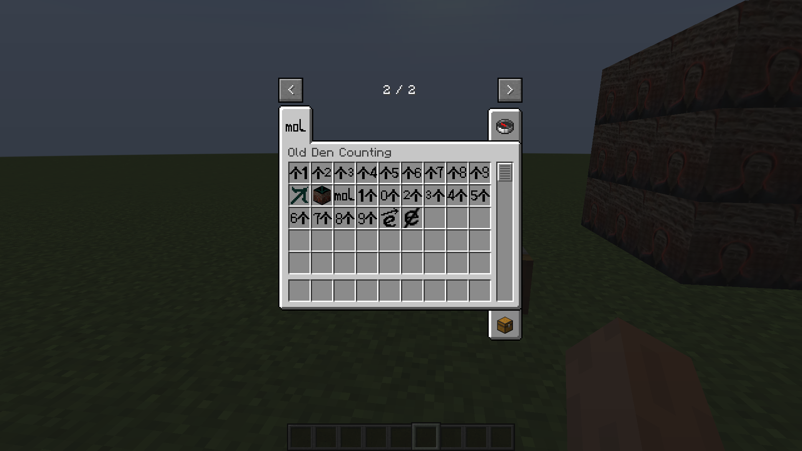

# MinecraftMod-OldDenCounting
**名称：老登计数法**  
**声明：本模组仅用作研究学习，无不良向导**  

# 使用方法
  - 将 `odcounting-<Mod版本号>-forge-1.19.2.jar` 放入 `mods` 文件夹中
  - 将 `OldDenCounting-<数据包版本号>.zip` 数据包放入 `datapacks` 文件夹中

# 内容介绍（1.0.0）
  - **新增物品和方块**
    
  - **加法运算**
    - 工作台无序合成
    - 仅限两个加数的加法运算
    - 如果结果小于等于10，则返回0~10的数字物品；如果结果大于10，则返回结果的小于等于10的最大乘数乘以对应个数
      
      
      
  - **乘法运算**
    - 工作台无序合成
    - 运算乘法时需要加入“乘号”以区分加法（具体方法见下图）
    - 仅限两个乘数的乘法运算
    - 如果结果小于等于10，则返回0~10的数字物品；如果结果大于10，则返回结果的小于等于10的最大乘数乘以对应个数
      
  - **除法运算**
    - 切石机切分
    - 放入切石机2~10的数字物品，切石机会将数字分为“整数因数”✖“整数因数”的形式
      
      
  - **老登矿石**
    - 自然界自动生成，高度为 `-64 ~ 32` 之间
    - 需要“老登稿”或钻石镐及以上稿子采集
    - 老登矿石会稳定掉落3个“1个”物品
      
      
  
