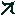
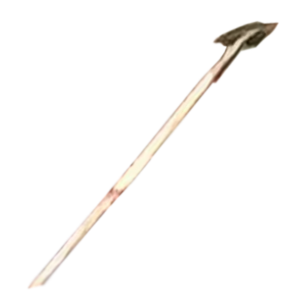

# MincraftMod-OldDenCounting

**老登计数法**

**一种新型计数方式**

**本模组仅用作研究、学习使用，不可用于其他用途！**

# 使用方法

- 将 `odcounting-<Mod版本号>-forge-1.19.2.jar` 放入 `mods` 文件夹中

- 将 `OldDenCounting-<对应Mod版本号>.zip` 数据包放入 `datapacks` 文件夹中

# 物品列表

- 数字物品：

  

  | 物品 |              展示              | 含义 |
  | :--------------------------------: | :----------------------------------------------------------: | :--------------------------------: |
  |                0个                 |     |                 0                  |
  |                1个                 |       |                 1                  |
  |                2个                 |       |                 2                  |
  |                3个                 |   |                 3                  |
  |                4个                 |     |                 4                  |
  |                5个                 |     |                 5                  |
  |                6个                 |       |                 6                  |
  |                7个                 |   |                 7                  |
  |                8个                 |   |                 8                  |
  |                9个                 |     |                 9                  |
  |                 摩                 |       |                 10                 |
  |                个1                 |   |                 -1                 |
  |                个2                 |   |                 -2                 |
  |                个3                 |  |                 -3                 |
  |                个4                 |  |                 -4                 |
  |                个5                 |  |                 -5                 |
  |                个6                 |   |                 -6                 |
  |                个7                 |  |                 -7                 |
  |                个8                 |  |                 -8                 |
  |                个9                 |  |                 -9                 |

- 运算物品：

  

  | 物品 |           展示            | 含义 |
  | :--------------------------------: | :-----------------------------------------------------: | :--------------------------------: |
  |                 额                 |      |                乘法                |
  |                 额                 |  |                除法                |
  |                 的                 |  |                乘方                |
  |                啊的                |                   ***制作中......***                    |                开方                |

- 其他物品：

  

  
  | 物品 |              展示              |              信息              |
  | :--------------------------------: | :----------------------------------------------------------: | :----------------------------------------------------------: |
  |              老登矿石              |  | 
<ul><li>类型：岩石<li>生成高度：[-64, +32]<li>每区块矿石平均数：8<li>每组矿石的平均数量：8<li>掉落物：×3<li>挖掘等级：3（钻石及以上）<li>所属标签：老登计数法<ul/> |
  |               老登稿               |  | 
<ul><li>类型：稿子<li>挖掘等级：3（钻石）<l>效率：12（金质）<li>附魔能力：10（钻石）<li>攻击伤害：5（钻石）<li>攻击速度：1.2（钻石）<li>耐久度：32（金质）<li/><li>用于修复的物品：<li>防火：True<li>合成界面修复：False<li>所属标签：老登计数法<ul/> |
  |               老登铲               |  | 
<ul><li>类型：铲子<li>挖掘等级：1（石质）<li>效率：15（>金质）<li>附魔能力：14（铁质）<li>攻击伤害：4（>下界合金）<li>耐久度：200 （石质< 200 <铁质）<li>用于修复的物品：<li>防火：False<li>合成界面修复：False<li/><li>所属标签：老登计数法<ul/> |
  |               王卓明               |  | 
<ul><li>类型：物品<li>用法：右击生老登实体***制作中...***<li>所属标签：老登计数法<ul/> |
  

# 